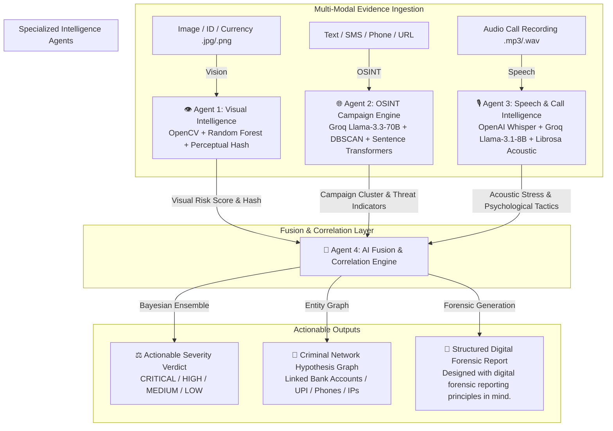

<div align="center">

# 🛡️ FCIS — Fraud Campaign Intelligence System
### Autonomous Multi-Agent AI System for Multi-Modal Cybercrime & Telecom Fraud Analysis

[](https://economictimes.indiatimes.com/)
[](https://python.org)
[](https://fastapi.tiangolo.com/)
[](https://vitejs.dev/)
[](https://groq.com/)
[](https://github.com/openai/whisper)
[](https://mongodb.com)

<p align="center">
  <b>A state-of-the-art, multi-modal, 4-agent autonomous forensic intelligence engine designed to detect, analyze, and correlate sophisticated Indian cybercrime campaigns, "Digital Arrests", telecom scams, and counterfeit operations in real time.</b>
</p>

---

</div>

## 🚨 The Problem: The Modern Cybercrime Epidemic

In India and across the globe, organized cybercrime has evolved into a industrial-scale enterprise. Fraud rings no longer rely on simple one-off phishing emails; they execute highly coordinated, **multi-modal campaigns** involving:
* **"Digital Arrest" & Authority Impersonation:** Victims are terrorized via phone calls by syndicates posing as **CBI**, **Customs**, **Enforcement Directorate (ED)**, or **RBI** officers.
* **Celebrity Impersonation & Social Engineering:** Fraudsters impersonating public figures via phone calls, urgent money requests, and compromised social credentials targeting high-net-worth individuals and citizens.
* **Counterfeit Currency & Forged KYC Documents:** Highly sophisticated physical currency counterfeits (`₹500` / `₹2000` notes) and altered Aadhaar/PAN cards used for money laundering and mule account creation.
* **Cross-Platform OSINT Syndicates:** Coordinated job scams, part-time task traps, and investment fraud networks advertised simultaneously across **Telegram**, **Reddit**, and fraudulent domain clusters.

Traditional security systems analyze these vectors in silos—speech analyzers miss text context, image scanners ignore phone call audio, and threat feeds lack real-time correlation. **The result is fragmented data and delayed law enforcement action.**

---

## ⚡ Our Solution: Multi-Agent Intelligence Pipeline 

**FCIS (Fraud Campaign Intelligence System)** solves this by unifying multi-modal digital forensics into a single, cohesive, autonomous AI ecosystem. When evidence (a call recording, a screenshot of a document or currency note, a suspicious SMS/WhatsApp text, a phone number, or a URL domain) is ingested, **four specialized autonomous agents** execute in parallel to produce a unified risk assessment and structured forensic report.



---

## 🧠 Deep-Dive: Architecture of the 4 Autonomous Agents

### 👁️ Agent 1: Visual Intelligence (Currency & ID Forensics)
Agent 1 is a vision and document forensic pipeline that flags visual indicators consistent with counterfeit currency notes (`₹500`, `₹2000`) and forged KYC identity documents (`Aadhaar`, `PAN`). It is designed as a triage/screening layer — surfacing images for human review — not a certified currency authentication system (which typically requires UV/IR imaging and physical security-thread inspection unavailable from a phone photo).
* **Multi-Tier Computer Vision:** Leverages **OpenCV** for micro-texture, color spectrum distribution, and physical dimensions check, alongside a **Scikit-Learn Random Forest** classifier trained on authentic vs. counterfeit security features.
* **Perceptual Cryptographic Hashing:** Computes exact **pHash**, **dHash**, and **aHash** signatures using `imagehash` to instantly cross-reference uploaded images against a live database of known counterfeit templates and previously reported scam flyers.
* **OCR & Tamper Detection:** Extracts printed text and verifies structural alignment, detecting digital manipulation and font anomalies common in synthetic ID theft.
Known limitation: detection accuracy depends heavily on image quality, lighting, and camera resolution; high-fidelity counterfeits may not be reliably distinguishable from a single RGB image.

### 🌐 Agent 2: OSINT Campaign & Text Intelligence
Agent 2 monitors real-world threat feeds across the internet and calculates campaign velocity.
* **Multi-Channel Scrapers & Ingestors:** Continuously scrapes and indexes reports from **Reddit** (`r/ScamsIndia`, `r/IsThisAScam`), **Telegram** fraud channels, and **National Cybercrime Reporting Portal (NCRP)** mock feeds.
Note: OSINT ingestion targets public posts/channels for research and fraud-pattern monitoring; production deployment should respect each platform's API terms of service and applicable data-protection regulations.
* **Density-Based Campaign Clustering (DBSCAN):** Uses **Sentence Transformers (`all-MiniLM-L6-v2`)** to convert incoming texts, phone numbers, and URLs into 384-dimensional dense semantic vectors. **DBSCAN** clusters these embeddings to determine whether an isolated user complaint is part of an active, nationwide cybercrime campaign involving dozens of linked reports (`campaign_score`).
* **Deep Threat Extraction via Groq:** Powered by **Groq Llama-3.3-70B-Versatile**, it extracts complex threat topologies, financial identifiers (`UPI IDs`, `Bank Accounts`), and malicious domain patterns using Groq's low-latency inference capabilities.

### 🎙️ Agent 3: Speech & Call Intelligence (Telecom Fraud Analyzer)
Agent 3 dissects live phone call recordings to expose psychological manipulation tactics and linguistic red flags used in scam calls.
* **Multilingual Transcription:** Utilizes **OpenAI Whisper Base** (`faster-whisper`) to transcribe high-speed, low-fidelity telecom recordings in **English**, **Hindi**, and **Hinglish** (`code-mixed`).
* **4-Layer Defense Engine:**
  1. **Keyword Trigger Engine:** Fast regex scanning for high-risk phrases (`CBI`, `Digital Arrest`, `Customs Parcel`, `OTP`, `ATM Pin`, `CVV`, `Celebrity Impersonation`).
  2. **Semantic Vector Matching:** Evaluates cosine similarity of call dialogue against a curated knowledge base of historical scam scripts using sentence embeddings.
  3. **Acoustic Anomaly Scoring:** Uses Librosa to extract signal-level features (zero-crossing rate, RMS energy, pitch/energy variance) that flag unusual call-audio patterns — e.g. flat affect, irregular pacing, or scripted delivery. This is a heuristic signal that feeds the fusion score, not a deepfake or voice-clone detector; the system does not claim to determine whether a voice is AI-generated.
  4. **Groq Llama-3.1-8B-Instant Profiling:** Analyzes conversational tactics to identify specific psychological vectors (`Urgency/Fear Inducement`, `Authority Impersonation`, `Isolation Tactics`).

### 🧠 Agent 4: AI Fusion Engine, Graph Network & Legal Evidence Generator
Agent 4 is the master orchestrator (`agent4/orchestrator.py`) that unifies all downstream intelligence into a single command center.
* **Bayesian / Ensemble Correlation Engine (`correlator.py`):** Dynamically weights confidence intervals and risk scores across Agent 1 (`Vision`), Agent 2 (`OSINT`), and Agent 3 (`Speech`). The Fusion Engine combines outputs from all specialized agents using configurable weighted scoring. Evidence from speech, text, images, and OSINT sources contributes to a single composite risk assessment with an associated confidence score.
* **Criminal Network Hypothesis Graph (`networkx`):** Automatically builds entity-relationship graphs linking phone numbers, bank accounts, UPI handles, cryptocurrency wallets, Telegram IDs, and IP addresses across disparate cases to map out the underlying criminal hierarchy (`network_graph.py`).
* **Case Risk Prioritization (predictor.py):** Analyzes correlated evidence and network relationships to help investigators prioritize which linked cases warrant urgent follow-up.
* **📄 Structured Digital Forensic Report (`evidence_package.py`):** Generates a structured forensic report containing evidence summaries, detected entities, confidence scores, timestamps, and analysis results from all four agents. When available, cryptographic hashes of uploaded evidence are included to support evidence integrity. The report is designed to assist investigators by consolidating findings into a clear, organized document for review and documentation.

---

## ✨ Key Technical Features & Highlights

* **🟢 Real-Time Server-Sent Events (SSE) Streaming:** The dashboard connects to `/api/v1/analyze/stream/{session_id}` over EventSource, delivering live, microsecond-level thought logs directly from each agent (`[AGENT1] OpenCV color profile checked...`, `[AGENT3] Whisper transcribing Hindi/Hinglish audio...`, `[FUSION] Correlating signals...`).
* **🌌 Stunning Glassmorphic UI:** Built with **React 18**, **TypeScript**, **Vite**, and **Tailwind CSS**. Features vibrant neon indicators (`#00F2FE` Cyan, `#8A2BE2` Violet, `#FF0055` Crimson), smooth **Framer Motion** animations, and intuitive interactive sliders.
* **🛡️ Resilient Dual-Mode Execution:**
  * **Live Mode:** Fully leverages **Groq API (`Llama-3.3-70B` / `Llama-3.1-8B`)**, **OpenAI Whisper**, and **MongoDB Atlas** for live, real-world forensic execution.
  * **Resilient Fallback Mode:** Engineered with robust exception handling and precomputed/mock engines (`_load_precomputed`). If external AI services are unavailable due to network issues, API limitations, or model loading failures, the system automatically switches to fallback responses, allowing demonstrations and testing to continue without interruption.
* **⚡ Efficient Multi-Modal Processing:** Optimized for low-latency execution by running the specialized agents in parallel and consolidating their outputs through the Fusion Engine. Actual processing time depends on hardware configuration, input size, and external AI service response times.

---

## 🛠️ Technology Stack

| Layer | Technologies & Libraries |
| :--- | :--- |
| **Core Backend** | Python 3.11+, FastAPI, Uvicorn, Pydantic v2, Python-dotenv, AsyncIO |
| **Large Language Models** | **Groq API** — `Llama-3.3-70B-Versatile` (OSINT & Fusion), `Llama-3.1-8B-Instant` (Call Profiling) |
| **Speech & Audio Forensics** | OpenAI Whisper (`whisper-base`), Librosa, Soundfile, SciPy, Torch |
| **Vision & Image Forensics** | OpenCV (`cv2`), Scikit-Learn (`RandomForestClassifier`), ImageHash (`pHash`, `dHash`), NumPy |
| **Machine Learning & Graph** | Sentence-Transformers (`all-MiniLM-L6-v2`), DBSCAN Clustering, NetworkX (`Graph Modeling`) |
| **Database & Ingestion** | MongoDB Atlas (`motor`/`pymongo`), Praw (`Reddit API`), Telethon/Pyrogram (`Telegram`) |
| **Frontend Dashboard** | Vite, React 18, TypeScript, Tailwind CSS, Lucide Icons, Framer Motion, TanStack Router |

---

## 🚀 Quick Start Guide (Zero to Running in 3 Minutes)

### Prerequisites
* **Python:** 3.11 or higher
* **Node.js:** 18 or higher & `npm`
* **Groq API Key:** [Get a free API key at console.groq.com](https://console.groq.com/)

### 1. Clone & Environment Setup
```bash
git clone https://github.com/your-username/fraud-campaign-intelligence.git
cd fraud-campaign-intelligence

# Create or configure your root .env file
echo "GROQ_API_KEY=your_groq_api_key_here" > .env
```

### 2. Launch the Python Backend (FastAPI Engine)
Open your first terminal window and start the backend server:
```bash
# Install Python dependencies
pip install -r requirements.txt
pip install -r agent3/requirements.txt
pip install -r agent4/requirements.txt

# Start the Agent 4 Orchestrator & API Server on Port 8000
cd agent4
uvicorn api.main:app --host 0.0.0.0 --port 8000 --reload
```
*Backend API documentation will be immediately available at: **`http://localhost:8000/docs`***

### 3. Launch the Frontend Dashboard
Open a second terminal window and start the Vite React development server:
```bash
cd frontend

# Install Node modules
npm install

# Start the interactive UI
npm run dev
```
*Frontend UI will launch instantly at: **`http://localhost:8081`***

---

## 📡 API Endpoints Reference

### `POST /api/v1/analyze`
Accepts multi-part form data containing any combination of evidence and executes the full 4-Agent pipeline.
* **Form Parameters:**
  * `session_id` *(string, optional)* — Unique UUID for SSE log synchronization.
  * `audio` *(File, optional)* — `.mp3` or `.wav` telecom/call recording.
  * `transcript` *(string, optional)* — Raw or pre-transcribed call dialogue.
  * `image` *(File, optional)* — `.jpg` or `.png` currency note, ID document, or scam flyer.
  * `text` *(string, optional)* — SMS, WhatsApp message, or email body.
  * `phone` *(string, optional)* — Suspect phone number (e.g., `+919876543210`).
  * `url` *(string, optional)* — Phishing URL or domain (`http://fake-cbi-portal.in`).
* **Response:** Returns a structured JSON response containing individual agent outputs, the fused risk assessment, detected entities, and generated analysis reports.

### `GET /api/v1/analyze/stream/{session_id}`
Server-Sent Events (SSE) stream returning real-time log lines from `AGENT1`, `AGENT2`, `AGENT3`, `AGENT4`, `FUSION`, and `SYSTEM` during active pipeline processing.

### `GET /api/v1/health`
Returns live diagnostics, active model verification (`Whisper`, `SentenceTransformers`, `Groq`), and database connection status.

---

## 🧪 Built-In Sample Cases for Testing

The dashboard comes pre-loaded with realistic, representative sample cases that you can run with **1-Click** right from the UI:
1. **Digital Arrest & CBI Impersonation Call:** High-risk audio + transcript featuring scammers posing as CBI/ED officers threatening immediate arrest over fabricated Aadhaar money laundering charges.
2. **Celebrity Impersonation & Card Fraud:** Social engineering transcript involving celebrity impersonation asking for urgent ATM card numbers and CVV codes.
3. **Counterfeit ₹500 / ₹2000 Currency Note:** Visual forensic sample demonstrating micro-texture failure and perceptual hash match against known counterfeit networks.
4. **KYC & Bank Phishing Campaign:** Multi-vector OSINT bundle linking a suspicious SMS, phone number, and phishing URL across 34 active Reddit and Telegram complaints.
